#  Create ServiceNow incidents for Similar Incidents in Watson AIOps

This article explains about how to create incidents in ServiceNow for `Similar Incidents` training in Watson AIOps.

The below steps to be followed to create incidents in ServiceNow.

1. Create ServiceNow users `demo1` and `demo2`
2. Assign `incident_manager` role to the above users
3. `demo1` user create Incidents
4. `demo2` user resolve those Incidents
5. `demo1` user close those Incidents

## 1. Create ServiceNow Users

Lets create `demo1` and `demo2` users using the steps below.

1. Enter `user` in the top left search box to get `Users` menu on the left menu bar.

2. Click on `Users` menu.

3. Click `New` button on the top.

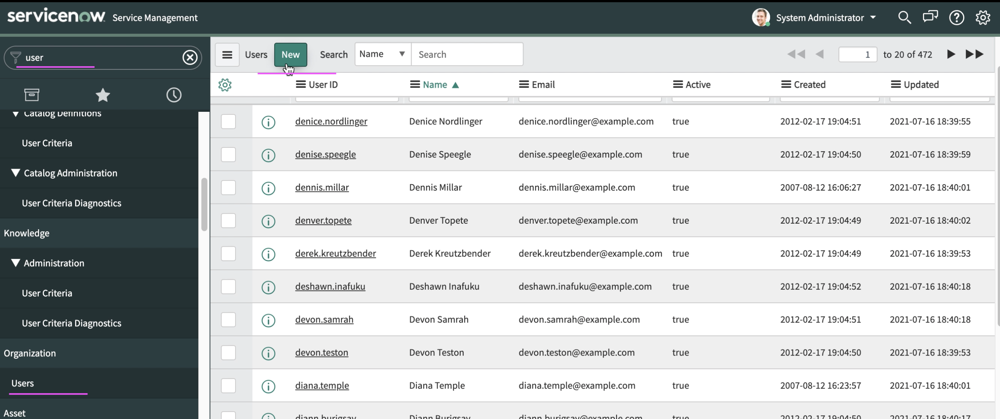

4. Enter the following values.

 - UserId. The value could be `demo1`.
 - FirstName
 - LastName
 - Password

5. Click on `Submit` button

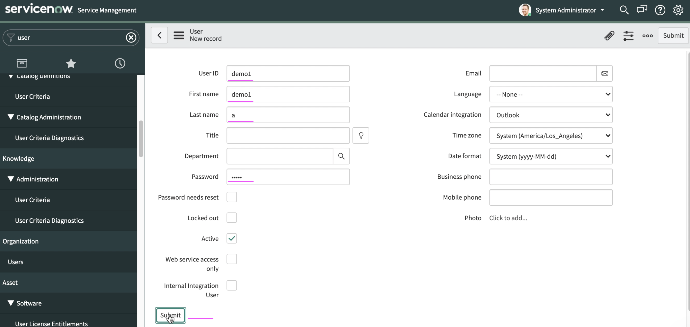

User would have been created and displayed like the below. 

6. Click `New` button on the top to create another user.

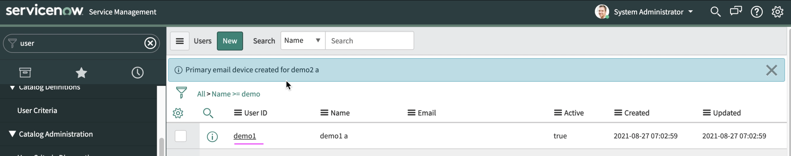

7. Enter the following values.

 - UserId. The value could be `demo2`.
 - FirstName
 - LastName
 - Password

8. Click on `Submit` button

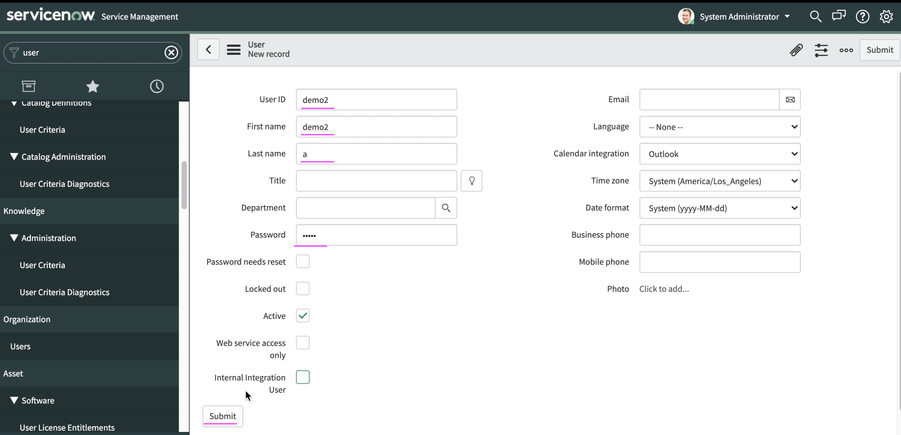

User would have been created and displayed like the below. 

## 2. Assign incident_manager Role

1. Choose the `demo1` user

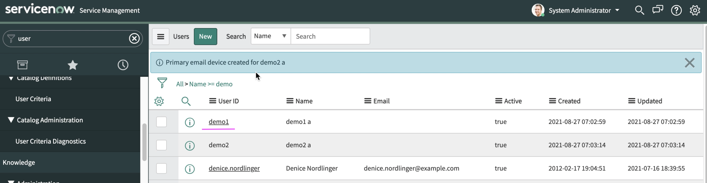

2. Click on `Edit` under the `Roles` tab

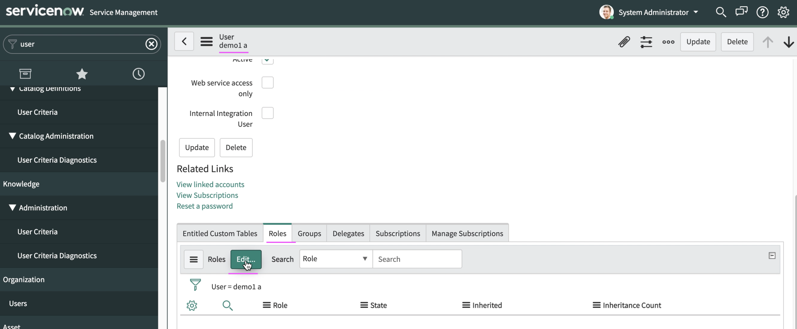

3. Type `incident` in the  `Collections` text box.

You should get `incident_manager` role displayed in the list box.

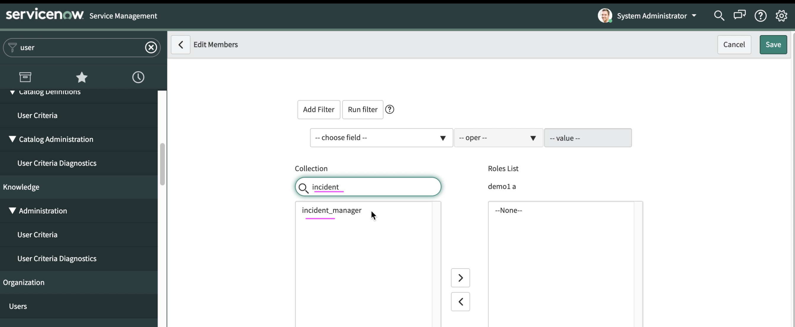

4. Move the role to the right side list box

5. Click on `Save` button to save this role.

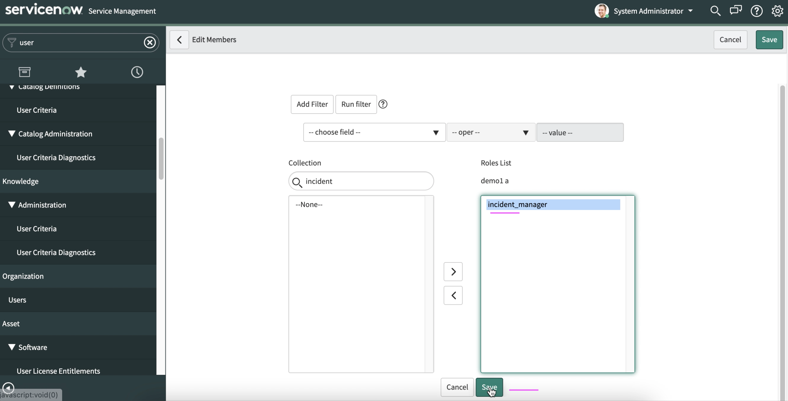

6. Repeat the same steps (1 to 5) for `demo2` user.

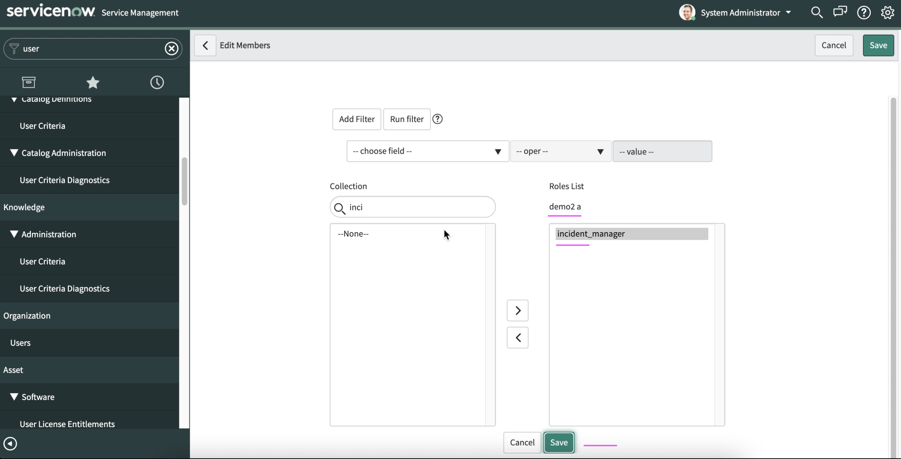

## 3. Create Incidents

Create incidents using `demo1` user.

1. Login as `demo1` user.

2. Enter `Incident` in the top left search box to get `Create New` menu on the left menu bar.

3. Click on `Create New` menu.

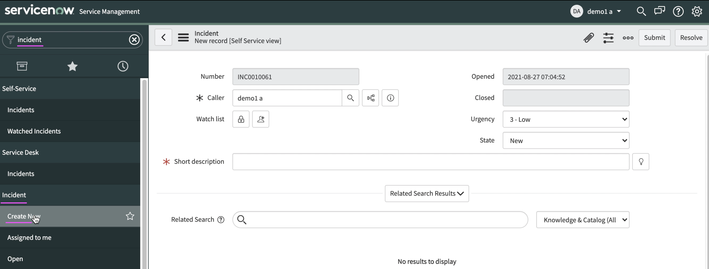

4. Enter the following values.

 - Caller 
 - Short Description
 - Description
 - Impact
 - Urgency
 - Priority

 You can use the following text for `Short Description`

```
Having problems with Creditscore service 
Unable to access Creditscore service
Creditscore service unavailable
Issue with Creditscore service
Cannot access Creditscore service
Creditscore service is Down
Creditscore service is not responding
```

5. Click on `Submit` button.

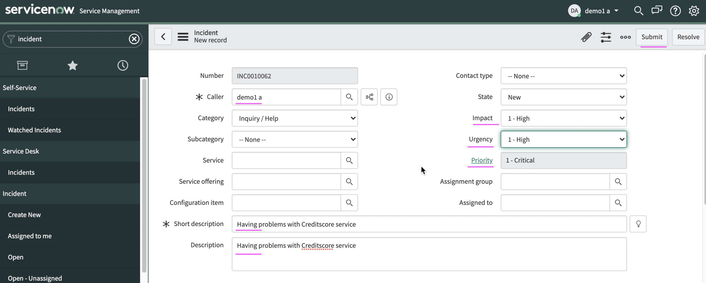

The incident would have been created and displayed like the below.

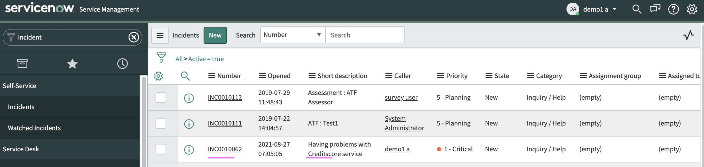

6. Repeat the steps 3, 4 and 5 to create atleast 5 incidents.

The incidents list would look like this.

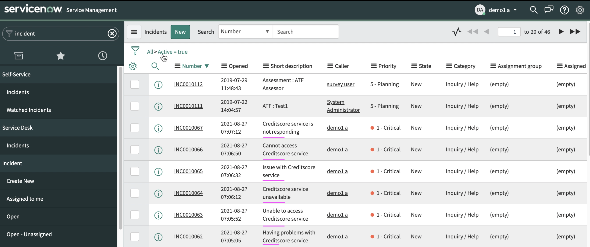


## 4. Resolve Incidents

Resolve incidents using `demo2` user.

1. Login as `demo2` user.

2. Enter `Incident` in the top left search box. It shows all opened incidents.

3. Click on `Incident` menu.

It shows the incident list as like below.

4. Select an incident from the list


5. Enter the following values.

 - Knowledge 
 - Resolution Code
 - Resolution Notes

  You can use the following text for `Resolution Notes`

```
Creditscore service pod is restarted and it is working now.
Creditscore pod is killed and it is functioning properly.
Reinstalled the Creditscore pod.
Redeploying the Creditscore service solved the problem.
```

6. Click on `Resolve` button.

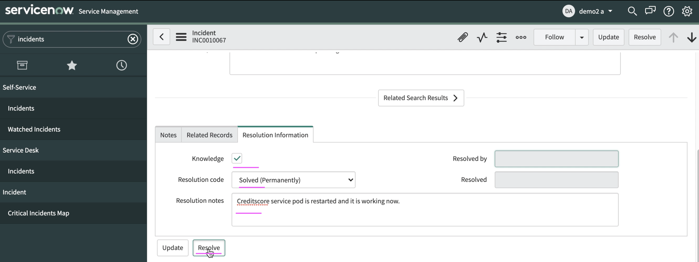

The incident is resolved.

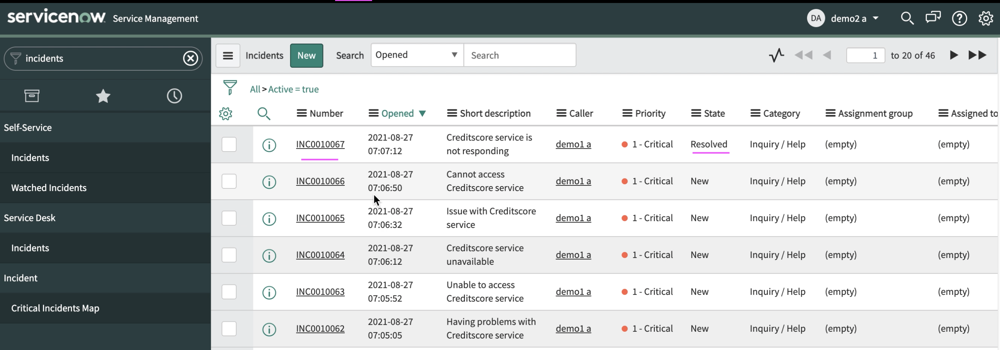

7. Repeat the steps 4, 5 and 6 to resolve all the 5 incidents created.

The incidents list would look like.

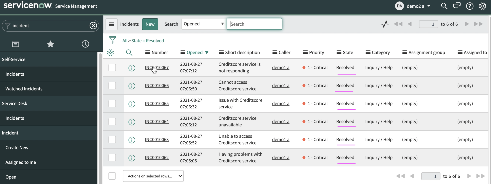

## 5. Resolve Incidents

Close incidents using `demo1` user.

1. Login as `demo1` user.

2. Goto incident list screen

3. Choose one incident from the list

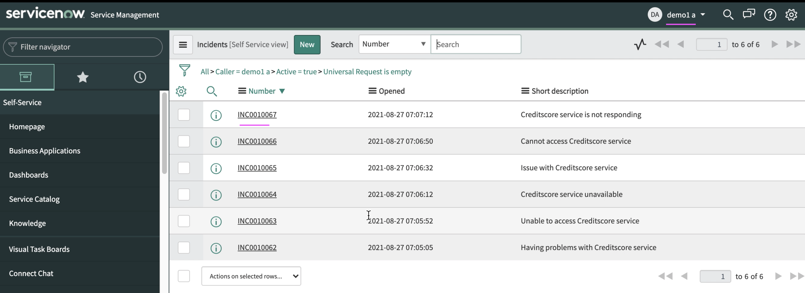

5. Enter the following values.

 - Additional Comments 

6. Click on `Close Incident` button.

The incident is resolved.

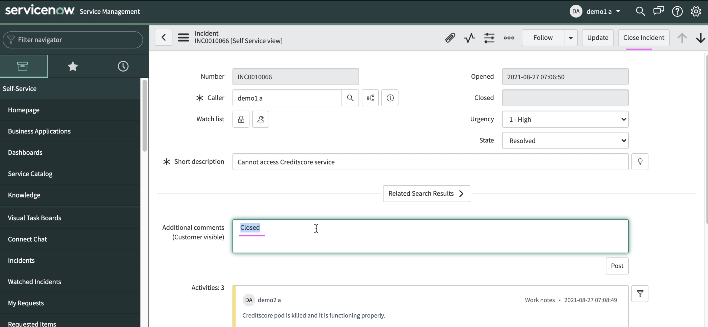

7. Repeat the steps 3, 4 and 5 to close all the 5 incidents created.
