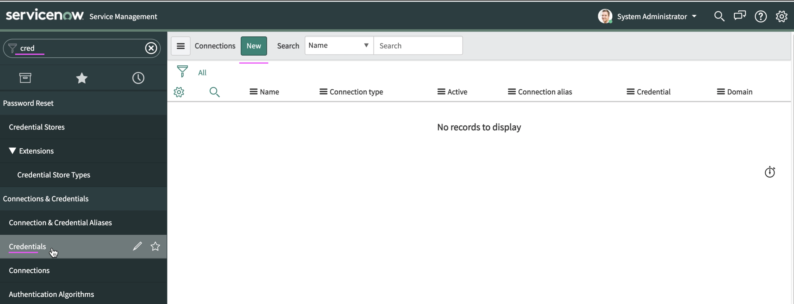
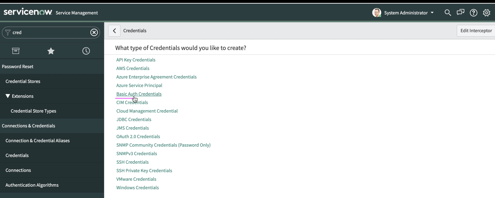
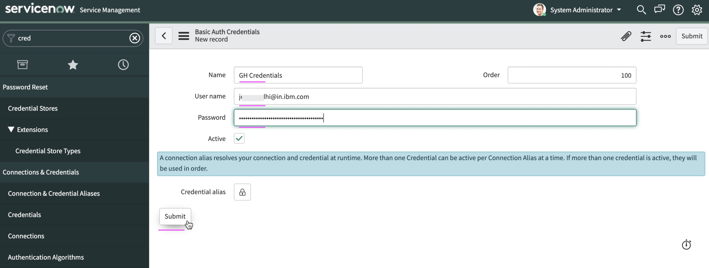
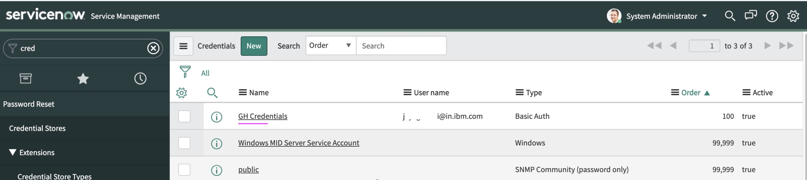
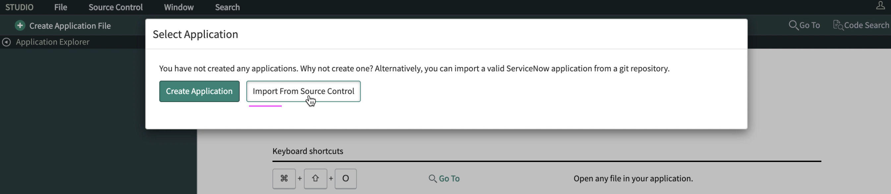
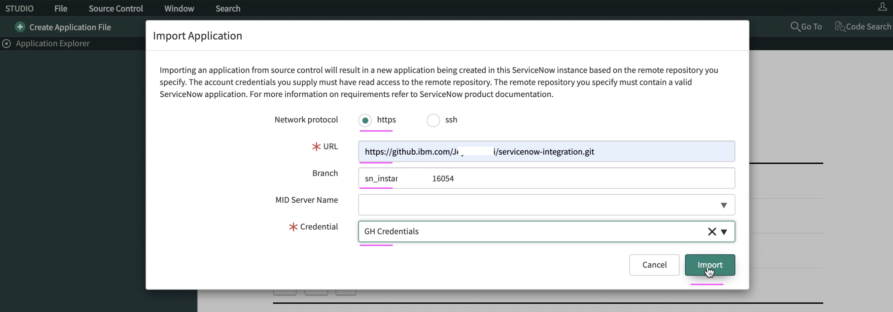
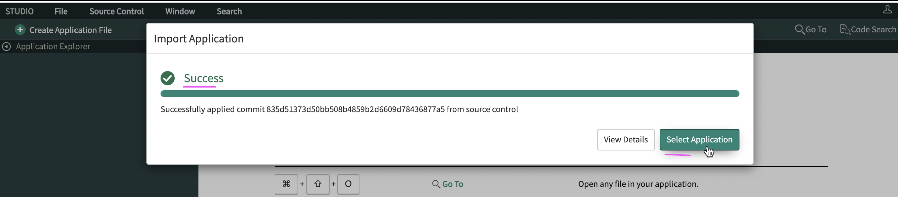

# Installing Watson AIOps App plugin in ServiceNow Developer Instance

This article explains about how to install Watson AIOps App plugin in ServiceNow Developer Instance.

Note: This article can be used only if you have access to IBM Github account (https://github.ibm.com)

## Pre-Requisite

1. ServiceNow Developer Instance
2. Personal Access Token of IBM Github account 

## 1. Create GitHub Credentials

1. Enter `cred` in the top left search box to get `Credentials` menu on the left menu bar.

2. Click on `Credentials` menu.

3. Click `New` button on the top.

4. Choose `Basic Auth Credentials` link.

5. Enter  the following.

 - Enter any text as `Name`
 - Give your IBM w3id in `User name`
 - Enter Personal Access Token of IBM Github account
 
6. Click on `Submit` button
 

7. The Auth Credentials get created and listed like below.

## 2. Fork the Plugin

Open the link https://github.ibm.com/jorgego/servicenow-integration-fork and fork it to your account. 

## 3. Import plugin from Source Control

1. Enter `studio` in the top left search box to get `Studio` menu on the left menu bar.

2. Click on `Studio` menu

It opens up a window 

3. Click on `Import from Source Control` button

4. Enter  the following.

 - Enter the aboved forked URL
 - Enter branch name as `main`
 - Enter Credentials as the one created above steps

5. Click on `Import` button

6. Once the import is success, Click on `Select Application` button

7. You will see Watson AIOps app installed and available.

## Note

In case of enterprise ServiceNow instance, the Watson AIOps App (plugin) can be installed from the official ServiceNow App Store (https://store.servicenow.com/sn_appstore_store.do#!/store/application/632a6d81db102010253148703996197e/1.1.0)

## References: 

#### 1. AIOps - Up and Running : ServiceNow Integration

https://pages.github.ibm.com/up-and-running/watson-aiops/3.1.1%20PoC%20Cookbooks/ServiceNow/#procure-a-servicenow-developer-instance

