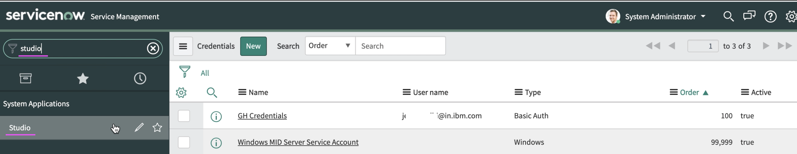
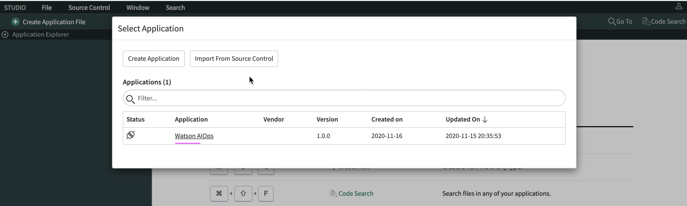

# Installing Watson AIOps App plugin in ServiceNow Developer Instance

This article explains about how to install Watson AIOps App plugin in ServiceNow Developer Instance.

## Pre-Requisite

1. ServiceNow Developer Instance
2. Access rights to https://github.com/ibm-gsi-ecosystem/watson-ai-ops-snow-plugin. Instruction is given below to get the access rights.

## 1. Create GitHub Credentials

1. Enter `cred` in the top left search box to get `Credentials` menu on the left menu bar.

2. Click on `Credentials` menu.

3. Click `New` button on the top.

4. Choose `Basic Auth Credentials` link.

5. Enter  the following.

 - Enter any text as `Name`
 - Give your IBM w3id in `User name`
 - Enter Personal Access Token of IBM Github account
 
6. Click on `Submit` button
 

7. The Auth Credentials get created and listed like below.

## 2. Fork the Plugin

Open the link https://github.com/ibm-gsi-ecosystem/watson-ai-ops-snow-plugin and fork it to your account. 

#### Access

Access to the `ibm-gsi-ecosystem/watson-ai-ops-snow-plugin` instance is strickly controlled, as this is source code level access. It should not be publically shared. To use this instance in a proof of concept / partner scenario where the market place is not available, contact the AIOps team.

Contacts:
- Olivier Bonnet (Director, Watson AIOps, Dev and Support) at olibonne@uk.ibm.com
- Neil Boyette (STSM, Watson AIOps) at neil.boyette@us.ibm.com
- Pramodh Vallanur Ramesh (Product Management, Watson AIOps) at vr.pramodh@ibm.com
- Morgan Timpson (Product Management, Watson AIOps) at mdtimpso@us.ibm.com

They will give you access to the github repository. You can then create an access key, specific to the PoC. You can use this key to install the application in ServiceNow. Once the engagement has completed the key should be removed.

## 3. Import plugin from Source Control

1. Enter `studio` in the top left search box to get `Studio` menu on the left menu bar.

2. Click on `Studio` menu

It opens up a window 

3. Click on `Import from Source Control` button

4. Enter  the following.

 - Enter the aboved forked URL
 - Enter branch name as `main`
 - Enter Credentials as the one created above steps

5. Click on `Import` button

6. Once the import is success, Click on `Select Application` button

7. You will see Watson AIOps app installed and available.

## Note

In case of enterprise ServiceNow instance, the Watson AIOps App (plugin) can be installed from the official ServiceNow App Store (https://store.servicenow.com/sn_appstore_store.do#!/store/application/632a6d81db102010253148703996197e/1.1.0)

## References: 

#### 1. AIOps - Up and Running : ServiceNow Integration

https://pages.github.ibm.com/up-and-running/watson-aiops/3.1.1%20PoC%20Cookbooks/ServiceNow/#procure-a-servicenow-developer-instance

