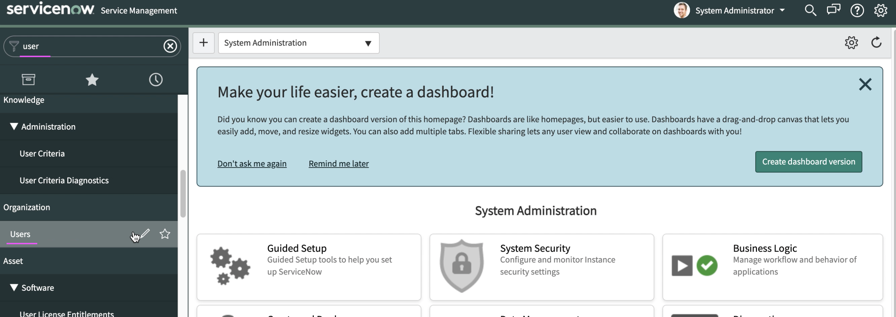
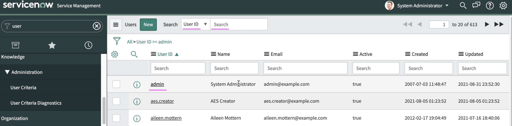
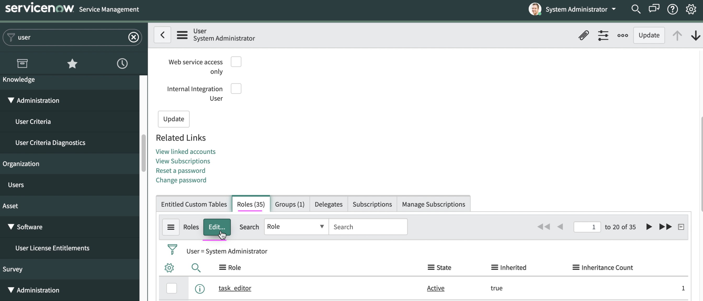
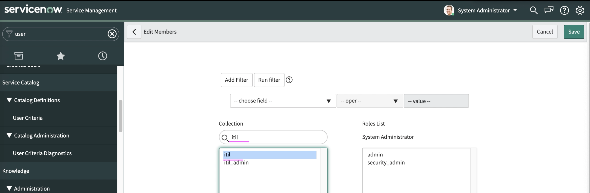
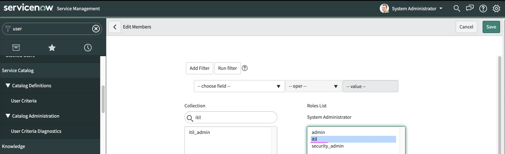
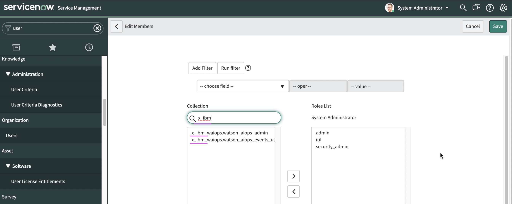
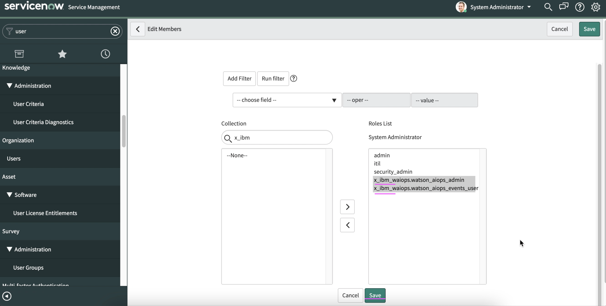

# Configuring Watson AIOps roles to ServiceNow users

This article explains about configuring Watson AIOps roles to the ServiceNow users. 

Watson AIOps creates Incidents in ServiceNow. In Order to communicate from Watson AIOps to ServiceNow, there is an integration entry created at Watson AIOps by specifying the ServiceNow user. This user should have below roles to create incidents in ServiceNow.

```
itil
x_ibm_waiops.watson_aiops_admin
x_ibm_waiops.watson_aiops_events_user
```

This article explains about how to assign these roles to ServiceNow user.

### Select User

1. Enter `user` in the top left search box to get `Users` menu on the left menu bar.

2. Click on `Users` menu.



3. Search for `admin` user (you can choose any user)

4. Choose the `admin` user



5. Click on `Edit` under the `Roles` tab



### Assign itil role

1. Type `itil` in the  `Collections` text box.

You should get `itil` role displayed in the list box.



2. Move the role to the right side list box



### Assign x_ibm_waiops role

1. Type `x_ibm` in the  `Collections` text box.

You should get the below roles displayed in the list box.

```
x_ibm_waiops.watson_aiops_admin
x_ibm_waiops.watson_aiops_events_user
```



2. Move the role to the right side list box



3. Click on `Save` button to save this role.

## References: 

1. AIOps - Up and Running : ServiceNow Integration

https://pages.github.ibm.com/up-and-running/watson-aiops/3.1.1%20PoC%20Cookbooks/ServiceNow/#procure-a-servicenow-developer-instance

